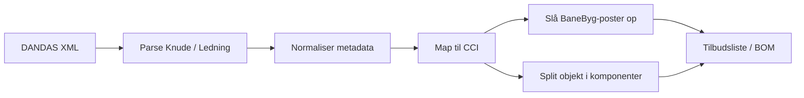

# DANDAS Tilbudsliste Showcase


Formålet er ikke at levere en færdig applikation. Formålet er at vise tankegangen og de vigtigste byggesten bag:

1. parsing af DANDAS XML
2. mapping fra DANDAS metadata til CCI-koder
3. kobling fra CCI til BaneByg-/tilbudslisteposter
4. opdeling af en DANDAS-brønd i komponenter
5. generering af en enkel tilbuds-/stykliste

Det her er derfor bedst læst som inspirationskode og teknisk dokumentation, ikke som et produktionsklart bibliotek.

## Hvad er med

- en lille parser til `Knude` og `Ledning`
- de vigtigste kode-tabeller fra vores DANDAS-flow
- et forsimplet eksempel på DANDAS -> CCI
- et forsimplet eksempel på CCI -> BaneByg
- et eksempel på hvordan en brønd kan splittes op i komponenter
- et eksempel på hvordan samme logik kan bruges til en tilbudsliste
- syntetiske demo-filer, inspireret af Aarhus-strukturen

## Hvad er ikke er med

- Flask-app
- database
- uploads
- viewer, panel-system og resten af CAD2BIM
- IFC/LAZ/LCA og øvrige dele af hovedløsningen
- vores fulde mapping-regelsæt og alle specialtilfælde

## Overblik

Dataflowet i hovedideen ser sådan ud:



## Mappestruktur

- `src/dandas_parser_inspiration.py`
  Viser den reducerede parser-idé for `Knude` og `Ledning`.
- `src/banebyg_link_inspiration.py`
  Viser hvordan CCI kan kobles til tilbudsliste-/BaneByg-poster.
- `src/manhole_components_inspiration.py`
  Viser hvordan vi splitter en brønd op i byggedele.
- `src/three_d_split_inspiration.js`
  Viser den 3D-tankegang vi bruger, når en brønd eller ledning deles i mesh-komponenter.
- `src/demo_flow.py`
  Binder de andre moduler sammen i et enkelt læseeksempel.
- `demo/Knude.synthetic.xml`
  Syntetisk knude-eksempel.
- `demo/Ledning.synthetic.xml`
  Syntetisk ledning-eksempel.

## Hvordan parser-delen hænger sammen

I vores egentlige løsning læser vi DANDAS XML og udtrækker især:

- navn på knude eller ledning
- materiale
- type af afløb
- diameter
- bundkoter og terrænkoter
- koordinater
- relationer mellem `fra_knude` og `til_knude`

I denne showcase er parseren med vilje holdt kort og læsbar. Den fokuserer kun på de felter, der er nødvendige for at forstå resten af flowet.

### Eksempel: knude

En knude giver typisk:

- `knude_type`
- `materiale`
- `diameter_mm`
- `bundkote`
- `terraenkote`
- `depth_m`
- koordinater

Det er nok til:

1. at klassificere den som fx gennemløbsbrønd eller sandfang
2. at mappe til en CCI-type
3. at opbygge en enkel komponentliste

### Eksempel: ledning

En ledning giver typisk:

- `fra_knude`
- `til_knude`
- `materiale`
- `diameter_indv_mm`
- `length_m`
- `type_afloeb`

Det er nok til:

1. at skelne mellem dræn, tæt ledning og trykledning
2. at mappe til en CCI-type
3. at foreslå rørsegmenter, samlinger og evt. filtermateriale

## Hvordan DANDAS kobles til CCI

Den centrale idé er, at vi ikke kun læser XML som rå data. Vi oversætter også objektets betydning.

Et simpelt eksempel:

- en `Knude` med kode for brønd
- plastmateriale
- diameter omkring `600 mm`

kan klassificeres som en bestemt CCI-type for en PP-gennemløbsbrønd.

Et andet eksempel:

- en `Ledning`
- type af afløb = dræn
- plastmateriale
- diameter `200 mm`

kan klassificeres som en CCI-type for et drænrør i den størrelse.

I hovedsystemet er reglerne mere omfattende. I denne mappe har vi kun taget de vigtigste mønstre med.

## Hvordan CCI kobles til BaneByg

Når et objekt først er mappet til en CCI-type, kan samme type bruges som nøgle til tilbudsliste-/BaneByg-poster.

Tankegangen er:

1. DANDAS fortæller os hvad objektet er og hvilke mål det har.
2. CCI giver os en teknisk klassifikation.
3. BaneByg-/tilbudsliste-koder bruges som de poster, man kan regne mængder og prislinjer på.

I denne showcase er det vist som en lille håndholdt mapping-tabel. I den fulde løsning læser vi også fra eksterne mapping-ark.

## Hvordan en brønd deles op i komponenter

I hovedløsningen behandler vi ikke kun en brønd som én cylinder. Vi deler den op i byggedele.

Typisk:

- bundstykke
- skaktringe
- eventuel reduktionskegle
- justeringsringe
- ramme og dæksel

Det giver to store fordele:

1. 3D-visningen bliver mere forklarende
2. tilbudslisten kan laves som en stykliste over faktiske komponenter

I `manhole_components_inspiration.py` er logikken skrevet så den er let at følge. Den er ikke en 1:1 kopi af hele produktionskoden, men samme idé.

## Hvordan tilbudsliste-delen hænger sammen

Tilbudslisten bygges i princippet ved at:

1. parse DANDAS-objektet
2. mappe til CCI
3. finde relevante BaneByg-poster
4. generere komponenter og mængder

Resultatet kan være en liste som fx:

- 1 bundstykke
- 3 skaktringe
- 1 reduktionskegle
- 2 justeringsringe
- 1 dæksel/rammesæt

eller for en ledning:

- 4 rørsegmenter
- 3 samlinger
- geotekstil i x meter
- filtergrus i y m3

## Om demo-data

De syntetiske XML-filer er ikke kundedata og ikke en kopi af hele Aarhus-materialet.

De er lavet for at ligne de mønstre, vi faktisk ser i Aarhus-data:

- plastbrønd omkring `Ø600`
- drænledning omkring `Ø200`
- relation mellem knuder og ledninger
- bundkoter, terrænkoter og materialeoplysninger

Det betyder, at strukturen og de vigtigste felter er realistiske nok til at demonstrere flowet, uden at hele projektdata deles.

## Hurtig læserækkefølge

Hvis man bare vil forstå løsningen hurtigt, så læs i denne rækkefølge:

1. `src/dandas_parser_inspiration.py`
2. `src/banebyg_link_inspiration.py`
3. `src/manhole_components_inspiration.py`
4. `src/demo_flow.py`
5. `src/three_d_split_inspiration.js`

## Eksempel på brug

Fra mappen kan man køre:

```powershell
python .\src\demo_flow.py
```

Det printer et lille eksempel på:

- parse-resultat
- valgt CCI-type
- tilhørende BaneByg-poster
- komponenter til tilbudsliste

## Vigtig note

Hvis nogen vil genbruge ideerne herfra, bør de se det som et arkitektur-eksempel:

- ikke hele vores kodebase
- ikke alle vores kanttilfælde
- ikke hele UI- eller databaseopsætningen

Den rigtige værdi i denne mappe er at gøre logikken forståelig:

- hvordan vi læser DANDAS
- hvordan vi oversætter til klassifikation
- hvordan vi kobler til tilbudsliste
- hvordan vi deler objekter op i komponenter
